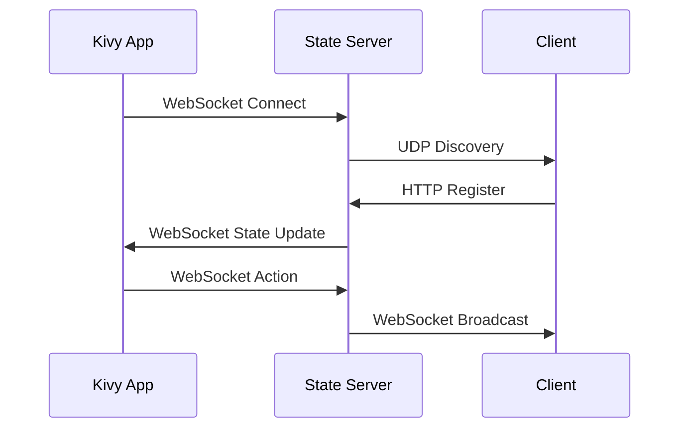

# Network Protocols

# Version History

- v1.0.0 (2024-03-21): Initial version

Last Updated: 2024-03-21 14:30 UTC

# Related Files

- [endpoints.md](./endpoints.md): Network API endpoints
- [examples.md](./examples.md): Usage examples

## Overview

This document describes the network protocols used in the application for communication between the Kivy app, client applications, and the state server.

## Protocol Types

### 1. WebSocket Protocol

Used for real-time communication and state synchronization.

#### Connection

```
ws://{host}:{port}/ws
```

#### Headers

```json
{
  "Authorization": "Bearer {token}",
  "Client-Type": "kivy|observer|player",
  "Device-ID": "{device_id}"
}
```

#### Message Format

```json
{
  "type": "string",
  "data": object,
  "timestamp": "ISO8601"
}
```

### 2. HTTP Protocol

Used for RESTful API communication.

#### Base URL

```
http://{host}:{port}/api/v1
```

#### Headers

```json
{
  "Authorization": "Bearer {token}",
  "Content-Type": "application/json",
  "Accept": "application/json"
}
```

#### Request Format

```json
{
  "method": "GET|POST|PUT|DELETE",
  "path": "string",
  "headers": object,
  "body": object
}
```

#### Response Format

```json
{
  "status": number,
  "headers": object,
  "body": object
}
```

### 3. UDP Protocol

Used for device discovery and network status.

#### Port

```
5353
```

#### Message Format

```json
{
  "type": "discovery|status",
  "data": object,
  "timestamp": "ISO8601"
}
```

## Protocol Flow



## Protocol Security

### 1. WebSocket Security

- WSS in production
- Token authentication
- Message validation
- Rate limiting

### 2. HTTP Security

- HTTPS in production
- Token authentication
- Input validation
- Rate limiting

### 3. UDP Security

- Port filtering
- Message validation
- Rate limiting
- IP restrictions

## Protocol Error Handling

### 1. WebSocket Errors

```javascript
// WebSocket error handling
ws.onerror = (error) => {
  console.error("WebSocket error:", error);
  handleConnectionError(error);
};

ws.onclose = (event) => {
  console.log("WebSocket closed:", event);
  handleConnectionClose(event);
};
```

### 2. HTTP Errors

```javascript
// HTTP error handling
async function handleHttpError(response) {
  if (!response.ok) {
    const error = await response.json();
    throw new Error(error.message);
  }
  return response;
}
```

### 3. UDP Errors

```javascript
// UDP error handling
socket.on("error", (error) => {
  console.error("UDP error:", error);
  handleUdpError(error);
});
```

## Protocol Best Practices

### 1. Connection Management

- Implement reconnection logic
- Handle connection timeouts
- Monitor connection health
- Implement fallback mechanisms

### 2. Message Handling

- Validate all messages
- Handle message ordering
- Implement message queuing
- Handle message timeouts

### 3. Error Recovery

- Implement retry logic
- Handle partial failures
- Implement rollback
- Monitor error rates

### 4. Performance

- Optimize message size
- Implement compression
- Use efficient protocols
- Monitor performance

## Protocol Examples

### 1. WebSocket Example

```javascript
// WebSocket connection
const ws = new WebSocket("ws://localhost:8080/ws", {
  headers: {
    Authorization: `Bearer ${token}`,
    "Client-Type": "player",
    "Device-ID": deviceId,
  },
});

ws.onopen = () => {
  console.log("Connected to server");
};

ws.onmessage = (event) => {
  const message = JSON.parse(event.data);
  handleMessage(message);
};

ws.onerror = (error) => {
  console.error("WebSocket error:", error);
};

ws.onclose = () => {
  console.log("Disconnected from server");
};
```

### 2. HTTP Example

```javascript
// HTTP request
async function makeRequest(method, path, data) {
  const response = await fetch(`http://localhost:8080/api/v1${path}`, {
    method: method,
    headers: {
      Authorization: `Bearer ${token}`,
      "Content-Type": "application/json",
    },
    body: JSON.stringify(data),
  });

  if (!response.ok) {
    throw new Error(`HTTP error: ${response.status}`);
  }

  return await response.json();
}
```

### 3. UDP Example

```javascript
// UDP socket
const socket = dgram.createSocket("udp4");

socket.on("message", (msg, rinfo) => {
  const message = JSON.parse(msg);
  handleUdpMessage(message, rinfo);
});

socket.on("error", (error) => {
  console.error("UDP error:", error);
});

socket.bind(5353);
```

## Protocol Monitoring

### 1. Health Checks

```javascript
// Protocol health check
async function checkProtocolHealth() {
  const health = {
    websocket: await checkWebSocketHealth(),
    http: await checkHttpHealth(),
    udp: await checkUdpHealth(),
  };

  return health;
}
```

### 2. Performance Monitoring

```javascript
// Protocol performance monitoring
function monitorProtocolPerformance() {
  const metrics = {
    websocket: {
      latency: measureWebSocketLatency(),
      throughput: measureWebSocketThroughput(),
      errorRate: measureWebSocketErrorRate(),
    },
    http: {
      latency: measureHttpLatency(),
      throughput: measureHttpThroughput(),
      errorRate: measureHttpErrorRate(),
    },
    udp: {
      latency: measureUdpLatency(),
      throughput: measureUdpThroughput(),
      errorRate: measureUdpErrorRate(),
    },
  };

  return metrics;
}
```

# Change Log

## 2024-03-21

- Initial documentation
- Added protocol types
- Added protocol flow
- Added protocol security
- Added error handling
- Added best practices
- Added examples
- Added monitoring
