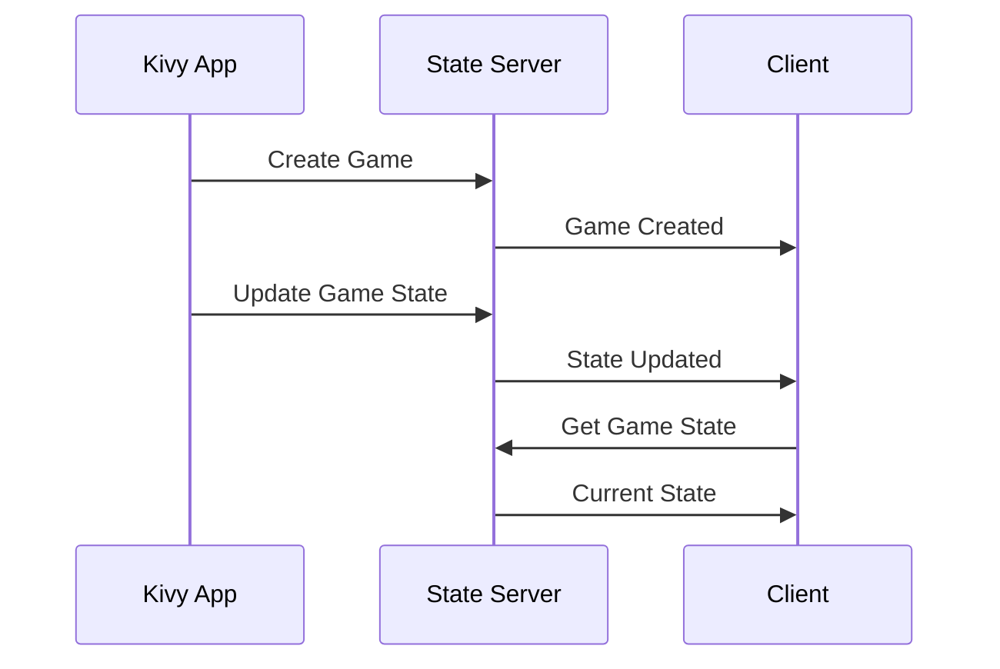

# State Management

# Version History

- v1.0.0 (2024-03-21): Initial version

Last Updated: 2024-03-21 14:30 UTC

# Related Files

- [endpoints.md](./endpoints.md): State server API endpoints
- [examples.md](./examples.md): Usage examples

## Overview

This document describes the state management system used in the application for handling game state, player state, and system state.

## State Types

### 1. Game State

```json
{
  "game_id": "string",
  "status": "string",
  "current_player": "string",
  "scores": {
    "player1": number,
    "player2": number
  },
  "timer": number,
  "settings": {
    "timer_duration": number,
    "max_score": number,
    "game_type": "string"
  },
  "created_at": "ISO8601",
  "updated_at": "ISO8601"
}
```

### 2. Player State

```json
{
  "player_id": "string",
  "game_id": "string",
  "name": "string",
  "role": "string",
  "status": "string",
  "score": number,
  "created_at": "ISO8601",
  "updated_at": "ISO8601"
}
```

### 3. System State

```json
{
  "system_id": "string",
  "status": "string",
  "version": "string",
  "settings": {
    "max_players": number,
    "max_games": number,
    "timeout": number
  },
  "created_at": "ISO8601",
  "updated_at": "ISO8601"
}
```

## State Flow



## State Management

### 1. State Creation

```javascript
// Create game state
async function createGameState(settings) {
  const response = await fetch("http://localhost:8080/api/v1/games", {
    method: "POST",
    headers: {
      Authorization: `Bearer ${token}`,
      "Content-Type": "application/json",
    },
    body: JSON.stringify({
      settings: settings,
    }),
  });

  return await response.json();
}

// Create player state
async function createPlayerState(gameId, name, role) {
  const response = await fetch(
    `http://localhost:8080/api/v1/players/${gameId}`,
    {
      method: "POST",
      headers: {
        Authorization: `Bearer ${token}`,
        "Content-Type": "application/json",
      },
      body: JSON.stringify({
        name: name,
        role: role,
      }),
    }
  );

  return await response.json();
}
```

### 2. State Updates

```javascript
// Update game state
async function updateGameState(gameId, state) {
  const response = await fetch(
    `http://localhost:8080/api/v1/game-state/${gameId}`,
    {
      method: "POST",
      headers: {
        Authorization: `Bearer ${token}`,
        "Content-Type": "application/json",
      },
      body: JSON.stringify({
        state: state,
      }),
    }
  );

  return await response.json();
}

// Update player state
async function updatePlayerState(playerId, state) {
  const response = await fetch(
    `http://localhost:8080/api/v1/player-state/${playerId}`,
    {
      method: "POST",
      headers: {
        Authorization: `Bearer ${token}`,
        "Content-Type": "application/json",
      },
      body: JSON.stringify({
        state: state,
      }),
    }
  );

  return await response.json();
}
```

### 3. State Retrieval

```javascript
// Get game state
async function getGameState(gameId) {
  const response = await fetch(
    `http://localhost:8080/api/v1/game-state/${gameId}`,
    {
      headers: {
        Authorization: `Bearer ${token}`,
      },
    }
  );

  return await response.json();
}

// Get player state
async function getPlayerState(playerId) {
  const response = await fetch(
    `http://localhost:8080/api/v1/player-state/${playerId}`,
    {
      headers: {
        Authorization: `Bearer ${token}`,
      },
    }
  );

  return await response.json();
}
```

## State Synchronization

### 1. Real-time Updates

```javascript
// WebSocket connection for real-time updates
const ws = new WebSocket("ws://localhost:8080/ws", {
  headers: {
    Authorization: `Bearer ${token}`,
    "Client-Type": "player",
    "Device-ID": deviceId,
  },
});

ws.onmessage = (event) => {
  const message = JSON.parse(event.data);

  switch (message.type) {
    case "game_state_update":
      handleGameStateUpdate(message.data);
      break;
    case "player_state_update":
      handlePlayerStateUpdate(message.data);
      break;
    case "system_state_update":
      handleSystemStateUpdate(message.data);
      break;
  }
};
```

### 2. State Validation

```javascript
// Validate game state
function validateGameState(state) {
  const required = ["game_id", "status", "current_player", "scores", "timer"];

  for (const field of required) {
    if (!(field in state)) {
      throw new Error(`Missing required field: ${field}`);
    }
  }

  if (state.timer < 0) {
    throw new Error("Timer cannot be negative");
  }

  if (state.scores.player1 < 0 || state.scores.player2 < 0) {
    throw new Error("Scores cannot be negative");
  }

  return true;
}

// Validate player state
function validatePlayerState(state) {
  const required = ["player_id", "game_id", "name", "role", "status", "score"];

  for (const field of required) {
    if (!(field in state)) {
      throw new Error(`Missing required field: ${field}`);
    }
  }

  if (state.score < 0) {
    throw new Error("Score cannot be negative");
  }

  return true;
}
```

## State Persistence

### 1. State Storage

```javascript
// Store game state
async function storeGameState(gameId, state) {
  const response = await fetch(
    `http://localhost:8080/api/v1/game-state/${gameId}/store`,
    {
      method: "POST",
      headers: {
        Authorization: `Bearer ${token}`,
        "Content-Type": "application/json",
      },
      body: JSON.stringify({
        state: state,
      }),
    }
  );

  return await response.json();
}

// Store player state
async function storePlayerState(playerId, state) {
  const response = await fetch(
    `http://localhost:8080/api/v1/player-state/${playerId}/store`,
    {
      method: "POST",
      headers: {
        Authorization: `Bearer ${token}`,
        "Content-Type": "application/json",
      },
      body: JSON.stringify({
        state: state,
      }),
    }
  );

  return await response.json();
}
```

### 2. State Recovery

```javascript
// Recover game state
async function recoverGameState(gameId) {
  const response = await fetch(
    `http://localhost:8080/api/v1/game-state/${gameId}/recover`,
    {
      headers: {
        Authorization: `Bearer ${token}`,
      },
    }
  );

  return await response.json();
}

// Recover player state
async function recoverPlayerState(playerId) {
  const response = await fetch(
    `http://localhost:8080/api/v1/player-state/${playerId}/recover`,
    {
      headers: {
        Authorization: `Bearer ${token}`,
      },
    }
  );

  return await response.json();
}
```

## State Monitoring

### 1. State Health

```javascript
// Check game state health
async function checkGameStateHealth(gameId) {
  const response = await fetch(
    `http://localhost:8080/api/v1/game-state/${gameId}/health`,
    {
      headers: {
        Authorization: `Bearer ${token}`,
      },
    }
  );

  return await response.json();
}

// Check player state health
async function checkPlayerStateHealth(playerId) {
  const response = await fetch(
    `http://localhost:8080/api/v1/player-state/${playerId}/health`,
    {
      headers: {
        Authorization: `Bearer ${token}`,
      },
    }
  );

  return await response.json();
}
```

### 2. State Metrics

```javascript
// Get game state metrics
async function getGameStateMetrics(gameId) {
  const response = await fetch(
    `http://localhost:8080/api/v1/game-state/${gameId}/metrics`,
    {
      headers: {
        Authorization: `Bearer ${token}`,
      },
    }
  );

  return await response.json();
}

// Get player state metrics
async function getPlayerStateMetrics(playerId) {
  const response = await fetch(
    `http://localhost:8080/api/v1/player-state/${playerId}/metrics`,
    {
      headers: {
        Authorization: `Bearer ${token}`,
      },
    }
  );

  return await response.json();
}
```

## Best Practices

1. **State Management**

   - Keep state atomic
   - Validate state changes
   - Handle state conflicts
   - Implement rollback

2. **State Synchronization**

   - Use real-time updates
   - Handle conflicts
   - Implement retry logic
   - Monitor sync status

3. **State Persistence**

   - Regular backups
   - Version control
   - Recovery procedures
   - Data integrity

4. **State Monitoring**
   - Track state changes
   - Monitor performance
   - Alert on issues
   - Log state events

# Change Log

## 2024-03-21

- Initial documentation
- Added state types
- Added state flow
- Added state management
- Added state synchronization
- Added state persistence
- Added state monitoring
- Added best practices
