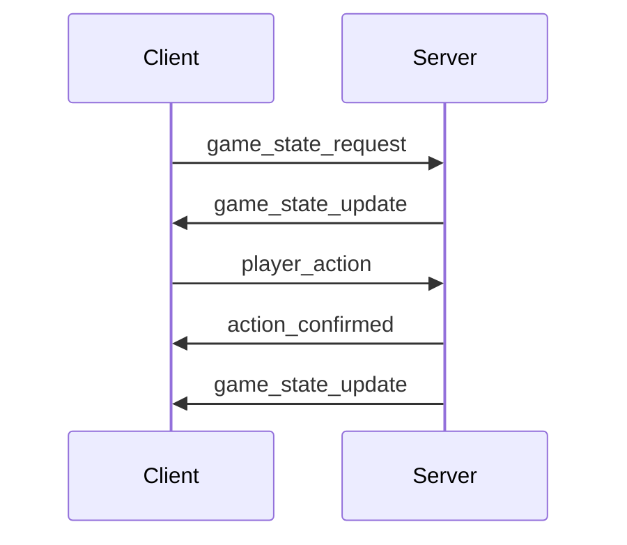

# WebSocket Events

# Version History

- v1.0.0 (2024-03-21): Initial version

Last Updated: 2024-03-21 14:30 UTC

# Related Files

- [endpoints.md](./endpoints.md): WebSocket API endpoints
- [examples.md](./examples.md): Usage examples

## Overview

This document details all WebSocket events used in the application, their payloads, and handling requirements.

## Event Types

### 1. Game State Events

#### `game_state_update`

Sent when game state changes.

**Direction**: Server → Client

**Payload**:

```json
{
  "type": "game_state_update",
  "data": {
    "game_id": "string",
    "state": {
      "current_player": "string",
      "scores": {
        "player1": number,
        "player2": number
      },
      "timer": number,
      "status": "string"
    },
    "timestamp": "ISO8601"
  }
}
```

**Handling**:

- Clients must update their local state
- UI must reflect changes immediately
- Timer must be synchronized

#### `game_state_request`

Request current game state.

**Direction**: Client → Server

**Payload**:

```json
{
  "type": "game_state_request",
  "data": {
    "game_id": "string"
  }
}
```

**Handling**:

- Server must respond with current state
- Response must include full state
- Must validate game_id

### 2. Player Events

#### `player_action`

Sent when a player performs an action.

**Direction**: Client → Server

**Payload**:

```json
{
  "type": "player_action",
  "data": {
    "game_id": "string",
    "player_id": "string",
    "action": "string",
    "value": any,
    "timestamp": "ISO8601"
  }
}
```

**Handling**:

- Server must validate action
- Must check player turn
- Must update game state
- Must broadcast to all clients

#### `action_confirmed`

Confirmation of player action.

**Direction**: Server → Client

**Payload**:

```json
{
  "type": "action_confirmed",
  "data": {
    "game_id": "string",
    "player_id": "string",
    "action": "string",
    "value": any,
    "timestamp": "ISO8601"
  }
}
```

**Handling**:

- Client must update UI
- Must show confirmation
- Must update local state

### 3. System Events

#### `connection_status`

Sent when connection status changes.

**Direction**: Server → Client

**Payload**:

```json
{
  "type": "connection_status",
  "data": {
    "status": "connected|disconnected|reconnecting",
    "reason": "string",
    "timestamp": "ISO8601"
  }
}
```

**Handling**:

- Client must update UI
- Must show status message
- Must handle reconnection

#### `error`

Sent when an error occurs.

**Direction**: Server → Client

**Payload**:

```json
{
  "type": "error",
  "data": {
    "code": "string",
    "message": "string",
    "details": object,
    "timestamp": "ISO8601"
  }
}
```

**Handling**:

- Client must show error message
- Must log error details
- Must handle recovery

### 4. Timer Events

#### `timer_start`

Start the game timer.

**Direction**: Server → Client

**Payload**:

```json
{
  "type": "timer_start",
  "data": {
    "game_id": "string",
    "duration": number,
    "timestamp": "ISO8601"
  }
}
```

**Handling**:

- Client must start timer
- Must show countdown
- Must handle completion

#### `timer_stop`

Stop the game timer.

**Direction**: Server → Client

**Payload**:

```json
{
  "type": "timer_stop",
  "data": {
    "game_id": "string",
    "timestamp": "ISO8601"
  }
}
```

**Handling**:

- Client must stop timer
- Must update UI
- Must handle state change

## Event Flow



## Error Handling

1. **Connection Loss**

   - Client must attempt reconnect
   - Must show reconnecting status
   - Must request state on reconnect

2. **Invalid State**

   - Client must request fresh state
   - Must show error message
   - Must handle recovery

3. **Action Denied**
   - Client must show error message
   - Must update UI
   - Must handle retry

## Best Practices

1. **Event Ordering**

   - Process events in order
   - Handle race conditions
   - Maintain state consistency

2. **Error Recovery**

   - Implement retry logic
   - Handle timeouts
   - Maintain user experience

3. **State Management**
   - Keep local state in sync
   - Handle conflicts
   - Implement rollback

# Change Log

## 2024-03-21

- Initial documentation
- Added all event types
- Added event flow diagram
- Added error handling
