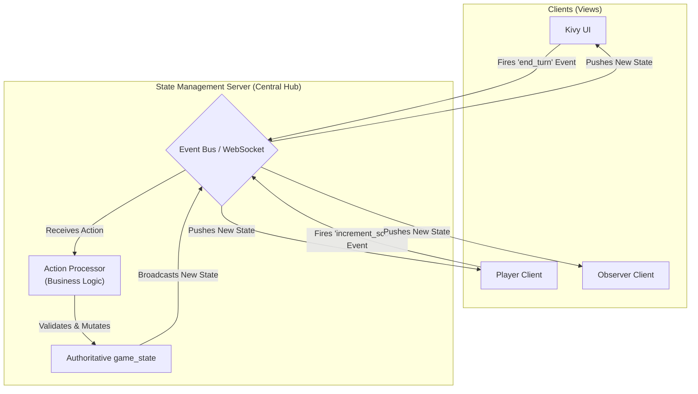

# Screen Architecture & Synchronization

This directory contains the documentation for all user-facing screens, including the main Kivy application and the browser-based web clients.

## Synchronization Principle: State Management Server

To solve issues of state management, the application will use a **State Management Server** pattern. This server is the central nervous system of the application.

1.  **Authoritative State**: The State Server holds the one and only authoritative `game_state`.
2.  **Clients are Views**: All other parts of the application (the Kivy UI, the Player Web Client, the Observer Web Client) act as pure "views." They subscribe to state updates but hold no state themselves.
3.  **Actions are Events**: When a user interacts with a view (e.g., presses a button), the view does not change its own state. Instead, it fires an event to the State Server (e.g., `{'action': 'increment_score', 'player': 1}`).
4.  **Centralized Logic**: The State Server contains all the business logic. It validates the incoming action, modifies the `game_state` accordingly, and then broadcasts the new, complete state to all subscribed clients.
5.  **Views Re-render**: All views, including the one that originated the action, receive the new state and re-render themselves to reflect it.

This model creates a robust, predictable, and easily debuggable system where the flow of data is explicit and unidirectional.

## Documentation Index

- [**Kivy Screens**](./kivy-screens/README.md): Documentation for the main application screens.
- [**Web Client Screens**](./clients/): Documentation for the observer and player client views.
