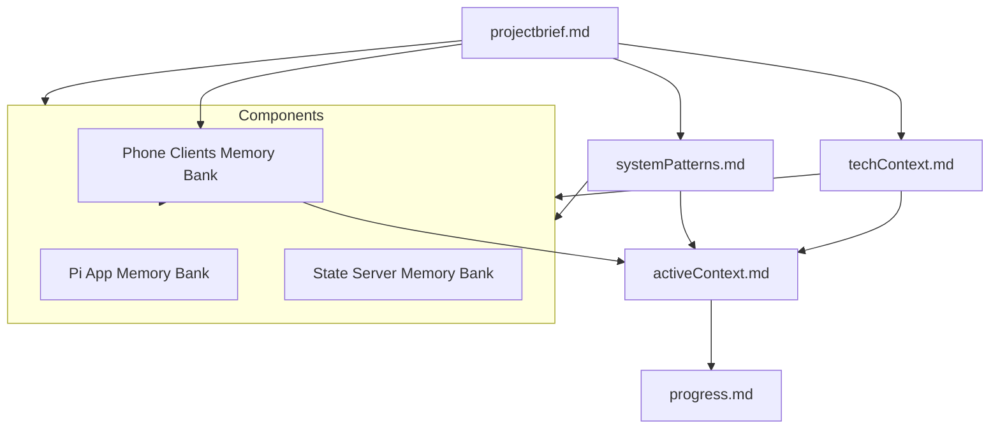

# Memory Bank Rules

## Mandatory Reading Requirements

BEFORE ANY TASK EXECUTION OR RESPONSE, THE FOLLOWING MUST BE READ AND CONFIRMED:

1. Memory Bank Files (MUST READ ALL, IN ORDER):

   - projectbrief.md
   - productContext.md
   - systemPatterns.md
   - techContext.md
   - activeContext.md
   - progress.md
   - im-a-dummy.md
   - memory_bank_rules.md

2. Component-Specific Memory Banks (MUST READ ALL PERTINENT FILES):
   - pi_app/memory-bank/\*
   - state_server/memory-bank/\*
   - phone_clients/memory-bank/\*

NO EXCEPTIONS: The assistant MUST:

1. Read ALL Memory Bank files
2. Read ALL relevant documentation
3. Explicitly confirm having read both
4. Only then proceed with any task or response

## Reference Structure

Each memory bank file MUST include:

1. **Cross-References Section**

   ```markdown
   ## Related Documentation

   ### Core Memory Bank

   - [projectbrief.md](../memory-bank/projectbrief.md)
   - [productContext.md](../memory-bank/productContext.md)
   - [systemPatterns.md](../memory-bank/systemPatterns.md)
   - [techContext.md](../memory-bank/techContext.md)
   - [activeContext.md](../memory-bank/activeContext.md)
   - [progress.md](../memory-bank/progress.md)
   - [im-a-dummy.md](../memory-bank/im-a-dummy.md)

   ### Component Memory Banks

   - [Pi App Memory Bank](../pi_app/memory-bank/)
   - [State Server Memory Bank](../state_server/memory-bank/)
   - [Phone Clients Memory Bank](../phone_clients/memory-bank/)
   ```

2. **Implementation References**
   - Each component's memory bank must reference its implementation files
   - Each implementation file must reference its memory bank documentation
   - All references must use relative paths

## Update Requirements

Memory Bank updates MUST occur when:

1. Discovering new project patterns
2. After implementing significant changes
3. When user requests with **update memory bank**
4. When context needs clarification

## Documentation Hierarchy



## Verification Process

Before proceeding with any task, the assistant MUST:

1. Read and confirm understanding of ALL memory bank files
2. Verify cross-references are complete and accurate
3. Check for any missing documentation
4. Ensure all component-specific documentation is up to date
5. Document any discrepancies found

## Documentation Updates

When updating documentation:

1. Update the relevant memory bank file
2. Update any cross-references
3. Update component-specific documentation if needed
4. Document the changes in activeContext.md
5. Update progress.md if implementation status changes

## Critical Rules

1. NO EXCEPTIONS to reading requirements
2. ALL changes must be documented
3. ALL references must be maintained
4. ALL components must be considered
5. ALL documentation must be consistent
