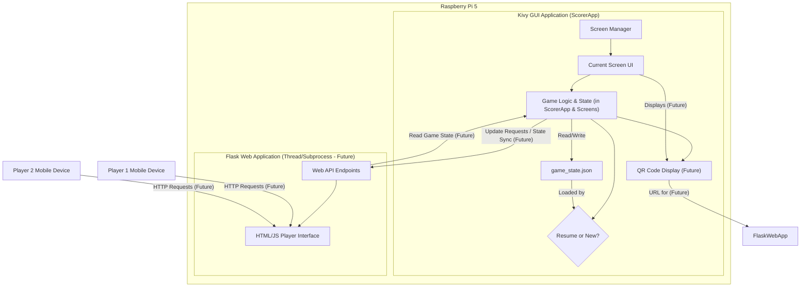
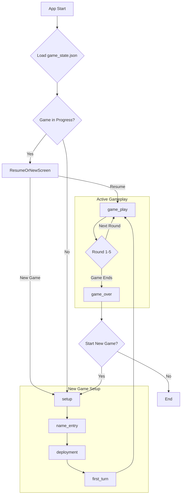
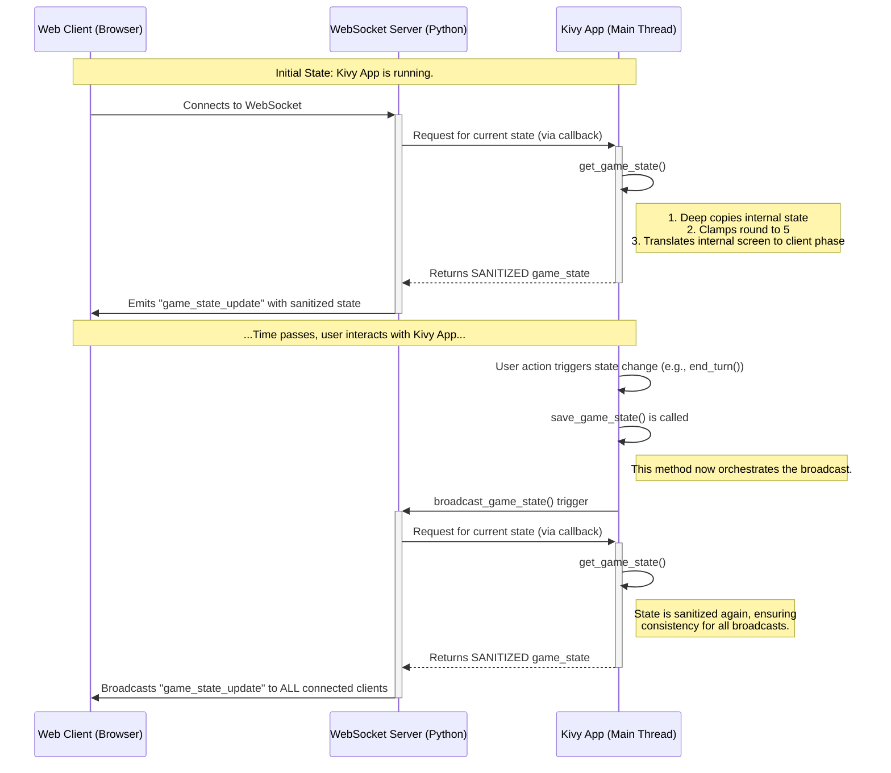
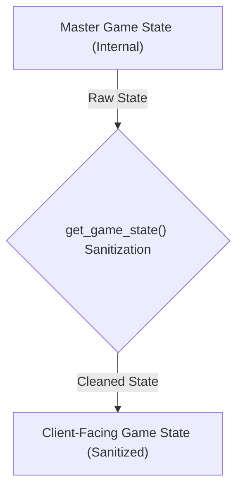

# System Patterns: Scorer

This document details the system architecture, key technical decisions, design patterns, and component relationships for Scorer.

## 1. System Architecture Overview

Scorer will be a Python application with two main components running concurrently on the Raspberry Pi 5:

1.  **Kivy GUI Application**: The primary user interface, running fullscreen on the 5-inch touchscreen. This component is responsible for displaying game information (scores, CPs, round, timer), handling direct touch interactions for all game management, managing the core game logic, and displaying QR codes for web access.
2.  **Flask Web Application**: A lightweight web server running in a separate thread (or potentially a subprocess managed by the Kivy app). This server provides a web API primarily for players to connect via their mobile devices to _view_ the complete game state. It also offers endpoints for players to _update their own_ scores/CPs, which are then synchronized with the Kivy application.

**Data Flow & State Management:**

- **Central Game State**: The `ScorerApp` (Kivy application main class) maintains the authoritative current game state (Player 1 Score, P1 CPs, Player 2 Score, P2 CPs, Current Round, Timer status, game phase, etc.). This state is held in a Python dictionary (`game_state`).
- **Data Persistence**: The `ScorerApp` is responsible for saving the current `game_state` to `game_state.json` (in the user's Kivy app data directory) on significant changes (like round advance, score update - to be fully verified for all cases) and on application exit. It also loads from this file on startup.
- **Startup Flow with `ResumeOrNewScreen`**:
  - On startup, `ScorerApp.load_game_state()` attempts to load `game_state.json`.
  - It determines if the loaded state represents a _meaningful_ in-progress game (i.e., not the initial 'setup' phase).
  - If a meaningful save exists, the `ResumeOrNewScreen` is displayed, offering to "Resume Game" or "Start New Game".
  - If no meaningful save exists, the application proceeds directly to the standard new game flow (e.g., `NameEntryScreen`).
- **Web API Interaction**: (Future Implementation)
  - The Flask web app will serve a simple HTML/JavaScript frontend to players' browsers.
  - When a player interacts with the web interface (e.g., to increase their score), the JavaScript frontend will make an API call (e.g., POST request) to a Flask endpoint.
  - The Flask endpoint will then need to communicate this update to the Kivy application. This could be achieved through inter-thread communication mechanisms (e.g., a Queue, or custom events if Kivy/Flask are in the same process and Kivy's event loop can be used).
  - The Kivy application, upon receiving an update from the Flask backend, will validate it, update its central game state, and refresh its UI. The updated state will then also be available for subsequent GET requests from any connected web clients.
- **QR Code**: The Kivy application will generate a QR code pointing to the local IP address and port of the Flask server, displayed on the touchscreen for easy connection.



## 2. Key Design Patterns & Considerations

- **Model-View-Controller (MVC) like structure for Kivy**:
  - **Model**: The `game_state` dictionary in `ScorerApp` and the logic for saving/loading it.
  - **View**: The Kivy widgets and UI layout defined in `scorer.kv` (e.g., `<ScorerRootWidget>:`, `<ResumeOrNewScreen>:`).
  - **Controller**: Python classes for each `Screen` (e.g., `ScorerRootWidget`, `NameEntryScreen`) and the main `ScorerApp` class. These handle user input from the touchscreen, update the model (`game_state`), and call methods to refresh the view (e.g., `update_ui_from_state`).
- **Kivy `ObjectProperty` and KV Binding**: Python class properties (e.g., `p1_name_label = ObjectProperty(None)` in a screen's Python class) must be explicitly mapped in the corresponding KV rule (e.g., `p1_name_label: p1_name_label_id`) to link the Python reference to the widget defined with `id: p1_name_label_id` in KV. This is crucial for accessing and manipulating widgets from Python code.
- **App Structure (`ScorerApp` vs. `Screen` subclasses)**: Core application lifecycle methods (`build`, `on_start`, `on_stop`, `load_game_state`, `_determine_screen_from_gamestate`) and management of global application state (`game_state`) reside in the main `ScorerApp` class. Screen-specific UI updates, event handling, and display logic are primarily managed within their respective `Screen` subclasses (e.g., `ScorerRootWidget.update_ui_from_state()`).
- **Deferred UI Updates with `Clock.schedule_once`**: When UI updates depend on widget properties that might not be immediately available after a screen transition or KV rule application (e.g., due to widget instantiation timing), `Clock.schedule_once(update_method, small_delay)` is used to defer the update slightly, allowing Kivy to fully prepare the widgets.
- **RESTful API for Flask**: (Future Implementation) The Flask app will expose simple RESTful endpoints.
- **Threading/Async for Web Server**: (Future Implementation) The Flask server will need to run without blocking Kivy's main loop.
- **Event-Driven Programming**: Kivy is event-driven. Touch interactions trigger events that are handled by methods in the Screen classes.
- **Clear Separation of Concerns**: Maintained between `ScorerApp` (global state, lifecycle) and individual `Screen` classes (screen-specific views and controllers).
- **Error Handling & Resilience**: Basic error handling is in place (e.g., for file loading). Needs to be reviewed for robustness, especially concerning `game_state.json`.

## 3. User Interface (UI) / User Experience (UX) Patterns

- **Touchscreen (Kivy)**:
  - Large, clear buttons (`ScoreboardButton` style) and text for easy readability and interaction.
  - Intuitive layout for scores, CPs, round, timer for both players on `ScorerRootWidget`.
  - Clear flow through setup screens (`NameEntryScreen`, `DeploymentSetupScreen`, `FirstTurnSetupScreen`).
  - `ResumeOrNewScreen` provides clear options on startup if saved data exists.
- **Web Interface (Flask/HTML/JS)**: (Future Implementation)
  - Mobile-first responsive design.

## 4. Global Visual Theme

- **Core Aesthetic**: The application adopts a consistent "Red vs. Blue" two-column visual theme across all screens, with the exception of the `SplashScreen`.
- **Background**: Achieved using `assets/background.png` on `ScorerRootWidget` and `BoxLayout`s with appropriate background colors for other screens like `ResumeOrNewScreen` and setup screens.
- **Content Organization**: Player 1 information is generally on the left (red side), Player 2 on the right (blue side).
- **Font**: "InterBlack" is registered via `LabelBase.register` and used for key headers and labels, as specified in `scorer.kv` (e.g., via `<InterBlack@Label>`).

This provides a high-level view. Specific implementation details of the Kivy UI layouts, Flask endpoints, and data structures will evolve during development.

## 5. Web Client (JavaScript) Architecture

- **Centralized Screen Controller**: The web client's UI is divided into distinct "screens" (e.g., Splash, Game, Game Over). The logic for determining which screen is visible MUST be centralized in a single controller or function. This controller listens for game state updates from the server and uses the `game_phase` property (`'splash'`, `'game_play'`, `'game_over') as the single source of truth to show the appropriate screen and hide all others. This describes the **Spectator Client**.
- **State-Driven UI**: Individual screen modules should not manage their own visibility. They should only be responsible for updating their internal content based on the game state they receive. The central controller handles the show/hide logic. This prevents state conflicts where, for example, the "Game Over" screen fails to hide when a new game starts.
- **Player Client (Future)**: A second, distinct web client will be created for players. It will be a minimal interface focused only on letting a player modify their own score/CP. It will be accessed via a player-specific QR code from the Kivy `NameEntryScreen` and will not contain the full splash/game/game-over flow.

## 6. High-Level Game Workflow

The application follows a defined sequence of states, or `game_phase`s, which dictate the application's current screen and behavior. This workflow is managed by the Kivy application and mirrored by the web client.



**Workflow Phases:**

- **Startup & Resume Logic**: On launch, the app checks for a saved game. If a meaningful game state is found, it presents a "Resume/New Game" choice. Otherwise, it proceeds directly to the new game setup.
- **New Game Setup**:
  - `setup`: Initializes a new game object.
  - `name_entry`: Players provide their names (Kivy & Web).
  - `deployment`: Players set up their pieces. The main game UI becomes visible.
  - `first_turn`: A player is selected to go first.
- **Gameplay Loop**:
  - `game_play`: The core state where players take turns, score points, and use the timer. The app cycles through rounds 1-5.
- **Game End**:
  - `game_over`: Displays the final results. From here, the user can initiate a new game, which restarts the workflow from the `setup` phase.

**Critical Game Rule: Round 5 End Condition**

- The game ends immediately after the second player completes their turn in Round 5.
- The round counter MUST NOT increment to 6.
- The `game_phase` must transition directly from `game_play` to `game_over`.

This state machine ensures a predictable flow for both the main Kivy application and the connected web clients.

## 7. Server-Side State Sanitization

- The server is the single source of truth, but its internal state may not be directly suitable for client consumption (e.g., during transient states like 'resume_or_new').
- The `get_game_state()` method, which provides data to the WebSocket server, MUST act as a sanitization layer.
- It is responsible for:
  1.  **Translating internal server states** (`resume_or_new` screen) into client-understandable game phases (`setup`). This prevents the client from getting stuck on a stale "Game Over" screen when the app is actually on the "Resume or New" screen.
  2.  **Enforcing critical game rules** by clamping values to their valid ranges (e.g., ensuring `current_round` is never greater than 5) before the state is sent.
- This ensures the client's state machine remains simple and robust, as it only ever receives clean, valid, and unambiguous game states.

## 8. WebSocket Communication Sequence

This diagram illustrates the real-time data flow between the Kivy application, the WebSocket server, and the web client. It highlights how the server acts as an intermediary and leverages the sanitization layer.



**Sequence Breakdown:**

1.  **Client Connection**: When a new web client connects, the WebSocket server immediately requests the current game state from the Kivy application.
2.  **Sanitization on Request**: The Kivy app's `get_game_state()` method is called. It creates a _sanitized copy_ of the state, clamping values like the round number and translating internal screen states (like `resume_or_new`) into client-friendly phases (`setup`).
3.  **Initial State Push**: The server sends this clean, safe state to the newly connected client in a `game_state_update` event.
4.  **Kivy-Side Game Event**: The user interacts with the Kivy app, which changes the internal `game_state`.
5.  **Broadcast Trigger**: Methods that modify the state (e.g., `end_turn`, `start_new_game_flow`) now reliably call `save_game_state()`.
6.  **Broadcast Action**: `save_game_state()` triggers the `broadcast_game_state()` method on the WebSocket server.
7.  **Sanitization on Broadcast**: The server again asks the Kivy app for the state via the `get_game_state()` callback, ensuring that even broadcasted data is always sanitized.
8.  **State Push to All Clients**: The server pushes the newly sanitized state to every connected client, ensuring all viewers are synchronized.

## 9. Master Game State Schema

This section defines the canonical data model for the application's `game_state`. This is the internal, server-side "source of truth". The client-facing model is a sanitized version of this master schema.



### 9.1. Internal (Master) Schema Definition

This is the complete data structure as used by the Kivy application.

```json
{
  "player1": {
    "name": "string",
    "primary_score": "integer",
    "secondary_score": "integer",
    "total_score": "integer",
    "cp": "integer",
    "deployment_roll": "integer",
    "first_turn_roll": "integer",
    "player_elapsed_time_seconds": "float",
    "player_time_display": "string (HH:MM:SS)"
  },
  "player2": {
    // Same structure as player1
  },
  "current_round": "integer (0-6)",
  "active_player_id": "integer | null",
  "deployment_initiative_winner_id": "integer | null",
  "deployment_attacker_id": "integer | null",
  "deployment_defender_id": "integer | null",
  "first_turn_choice_winner_id": "integer | null",
  "first_player_of_game_id": "integer | null",
  "last_round_played": "integer",
  "game_phase": "string ('setup', 'name_entry', 'deployment', 'first_turn', 'game_play', 'game_over')",
  "game_timer": {
    "status": "string ('running' or 'stopped')",
    "start_time": "float (timestamp)",
    "elapsed_display": "string (HH:MM:SS)",
    "turn_segment_start_time": "float (timestamp)"
  },
  "status_message": "string"
}
```

### 9.2. Client-Facing (Sanitized) Game State Object

This is the definitive structure of the JSON object that the web client receives. It is a simplified and validated version of the Master Schema, produced by the `get_game_state()` function. Note the exclusion of internal-only fields like roll results and raw timestamps.

```json
{
  "player1": {
    "name": "string",
    "primary_score": "integer",
    "secondary_score": "integer",
    "total_score": "integer",
    "cp": "integer",
    "player_time_display": "string (HH:MM:SS)"
  },
  "player2": {
    "name": "string",
    "primary_score": "integer",
    "secondary_score": "integer",
    "total_score": "integer",
    "cp": "integer",
    "player_time_display": "string (HH:MM:SS)"
  },
  "current_round": "integer (1-5)",
  "active_player_id": "integer (1 or 2) | null",
  "game_phase": "string ('setup', 'name_entry', 'deployment', 'first_turn', 'game_play', 'game_over')",
  "game_timer": {
    "status": "string ('running' or 'stopped')",
    "elapsed_display": "string (HH:M:SS)"
  },
  "status_message": "string"
}
```
