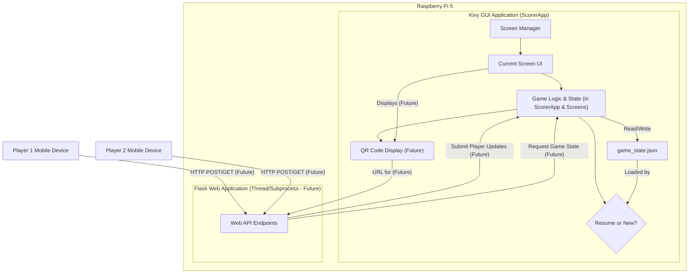
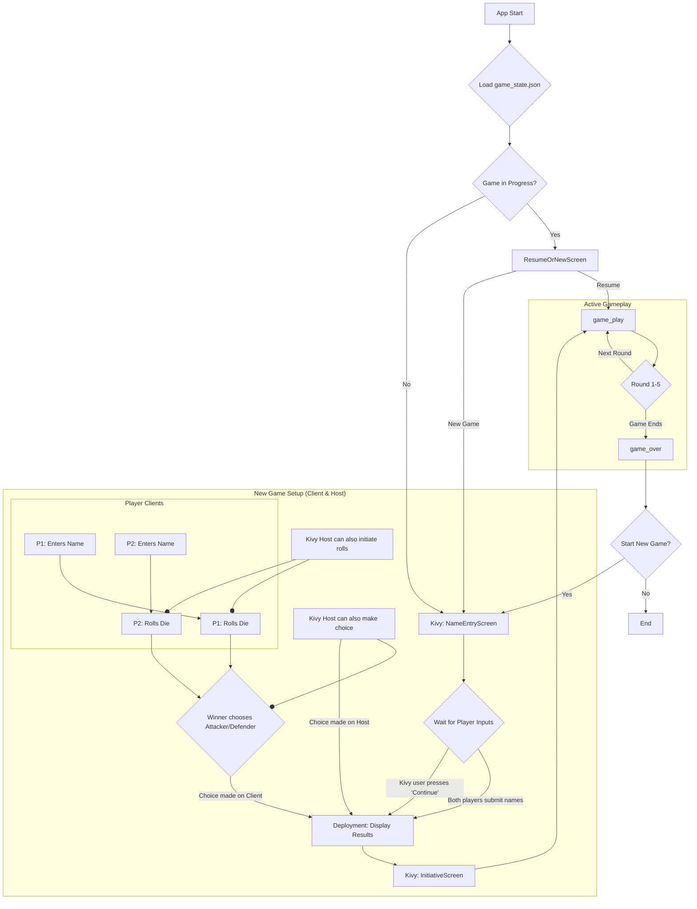
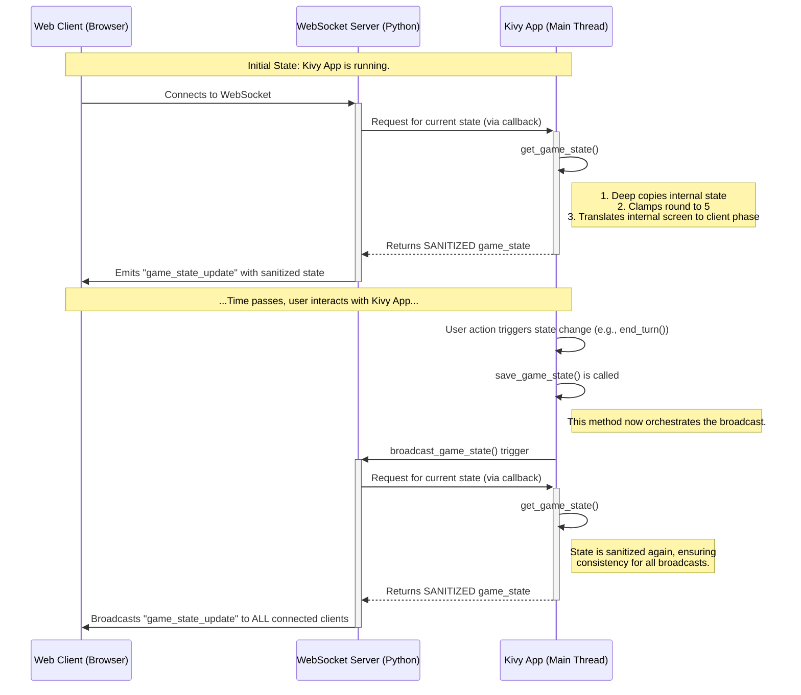
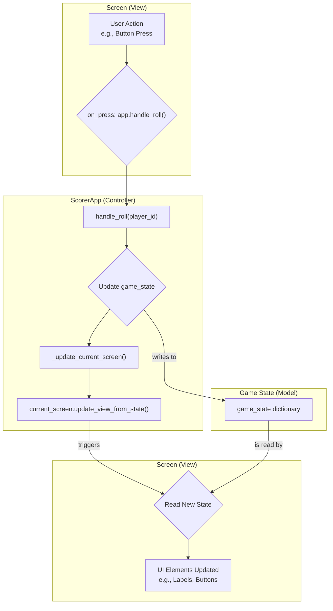
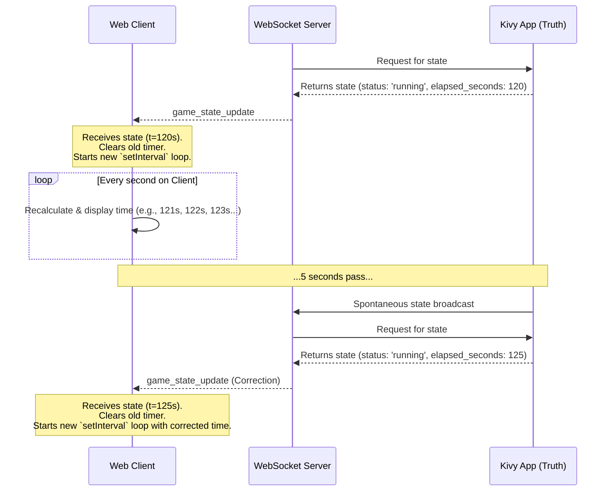
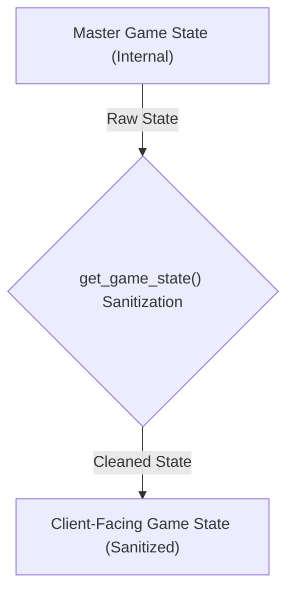
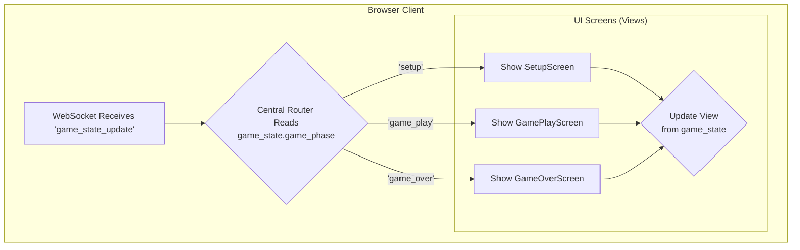
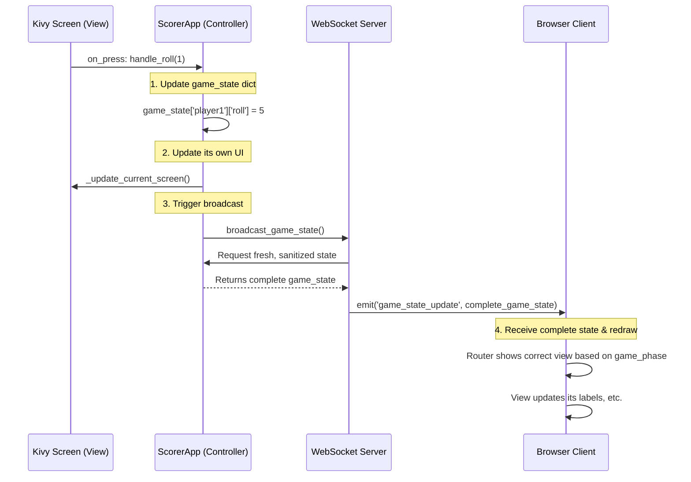

# System Patterns: Scorer

This document details the system architecture, key technical decisions, design patterns, and component relationships for Scorer.

## 1. System Architecture Overview

Scorer will be a Python application with two main components running concurrently on the Raspberry Pi 5:

1.  **Kivy GUI Application**: The primary user interface, running fullscreen on the 5-inch touchscreen. This component is responsible for displaying game information (scores, CPs, round, timer), handling direct touch interactions for all game management, managing the core game logic, and displaying QR codes for web access.
2.  **Flask Web Application**: A lightweight web server running in a separate thread (or potentially a subprocess managed by the Kivy app). This server provides a web API primarily for players to connect via their mobile devices to _view_ the complete game state. It also offers endpoints for players to _update their own_ scores/CPs, which are then synchronized with the Kivy application.

**Data Flow & State Management:**

- **Central Game State**: The `ScorerApp` (Kivy application main class) maintains the authoritative current game state (Player 1 Score, P1 CPs, Player 2 Score, P2 CPs, Current Round, Timer status, game phase, etc.). This state is held in a Python dictionary (`game_state`). This state now includes more detailed setup properties like `p1_name`, `p2_name`, `p1_deployment_roll`, `p2_deployment_roll`, and `attacker_player_id`. The scoring has been further broken down to track Primary and Secondary objective scores independently, with the total score being a sum of these two.
- **Data Persistence**: The `ScorerApp` is responsible for saving the current `game_state` to `game_state.json` (in the user's Kivy app data directory) on significant changes (like round advance, score update - to be fully verified for all cases) and on application exit. It also loads from this file on startup.
- **Startup Flow with `ResumeOrNewScreen`**:
  - On startup, `ScorerApp.load_game_state()` attempts to load `game_state.json`.
  - It determines if the loaded state represents a _meaningful_ in-progress game (i.e., not the initial 'setup' phase).
  - If a meaningful save exists, the `ResumeOrNewScreen` is displayed, offering to "Resume Game" or "Start New Game".
  - If no meaningful save exists, the application proceeds directly to the standard new game flow (e.g., `NameEntryScreen`).
- **Web API Interaction**: (Future Implementation)
  - The Flask web app, running in a background thread, provides API endpoints.
  - Player clients (on mobile devices) send HTTP requests (e.g., GET to read state, POST to update score) to the Flask API.
  - For writes, the `FlaskAPI` submits the player's updates to the `KivyLogic`.
  - For reads, the `FlaskAPI` requests the current game state from the `KivyLogic`.
  - The `KivyLogic` remains the single source of truth, validating all incoming updates and providing the state for all read requests.
- **QR Code**: The Kivy application will generate QR codes pointing to the `FlaskAPI`'s address, allowing player and spectator clients to connect easily.



## 2. Key Design Patterns & Considerations

- **Model-View-Controller (MVC) like structure for Kivy**:
  - **Model**: The `game_state` dictionary in `ScorerApp` and the logic for saving/loading it.
  - **View**: The Kivy widgets and UI layout defined in `scorer.kv` (e.g., `<ScorerRootWidget>:`, `<ResumeOrNewScreen>:`).
  - **Controller**: Python classes for each `Screen` (e.g., `ScorerRootWidget`, `NameEntryScreen`) and the main `ScorerApp` class. These handle user input from the touchscreen, update the model (`game_state`), and call methods to refresh the view (e.g., `update_ui_from_state`).
- **Kivy `ObjectProperty` and KV Binding**: Python class properties (e.g., `p1_name_label = ObjectProperty(None)` in a screen's Python class) must be explicitly mapped in the corresponding KV rule (e.g., `p1_name_label: p1_name_label_id`) to link the Python reference to the widget defined with `id: p1_name_label_id` in KV. This is crucial for accessing and manipulating widgets from Python code.
- **App Structure (`ScorerApp` vs. `Screen` subclasses)**: Core application lifecycle methods (`build`, `on_start`, `on_stop`, `load_game_state`, `_determine_screen_from_gamestate`) and management of global application state (`game_state`) reside in the main `ScorerApp` class. Screen-specific UI updates, event handling, and display logic are primarily managed within their respective `Screen` subclasses (e.g., `ScorerRootWidget.update_ui_from_state()`).
- **Deferred UI Updates with `Clock.schedule_once`**: When UI updates depend on widget properties that might not be immediately available after a screen transition or KV rule application (e.g., due to widget instantiation timing), `Clock.schedule_once(update_method, small_delay)` is used to defer the update slightly, allowing Kivy to fully prepare the widgets.
- **RESTful API for Flask**: (Future Implementation) The Flask app will expose simple RESTful endpoints.
- **Threading/Async for Web Server**: (Future Implementation) The Flask server will need to run without blocking Kivy's main loop.
- **Event-Driven Programming**: Kivy is event-driven. Touch interactions trigger events that are handled by methods in the Screen classes.
- **Clear Separation of Concerns**: Maintained between `ScorerApp` (global state, lifecycle) and individual `Screen` classes (screen-specific views and controllers).
- **Error Handling & Resilience**: Basic error handling is in place (e.g., for file loading). Needs to be reviewed for robustness, especially concerning `game_state.json`.

## 3. User Interface (UI) / User Experience (UX) Patterns

- **Touchscreen (Kivy)**:
  - Large, clear buttons (`ScoreboardButton` style) and text for easy readability and interaction.
  - Intuitive layout for scores, CPs, round, timer for both players on `ScorerRootWidget`.
  - Clear flow through setup screens (`NameEntryScreen`, `DeploymentSetupScreen`, `FirstTurnSetupScreen`).
  - `ResumeOrNewScreen` provides clear options on startup if saved data exists.
- **Web Interface (Flask/HTML/JS)**: (Future Implementation)
  - Mobile-first responsive design.

## 4. Global Visual Theme

- **Core Aesthetic**: The application adopts a consistent "Red vs. Blue" two-column visual theme across all screens, with the exception of the `SplashScreen`.
- **Background**: Achieved using `../assets/background.png` on `ScorerRootWidget` and `BoxLayout`s with appropriate background colors for other screens like `ResumeOrNewScreen` and setup screens.
- **Content Organization**: Player 1 information is generally on the left (red side), Player 2 on the right (blue side).
- **Font**: "InterBlack" is registered via `LabelBase.register` and used for key headers and labels, as specified in `scorer.kv` (e.g., via `<InterBlack@Label>`).

This provides a high-level view. Specific implementation details of the Kivy UI layouts, Flask endpoints, and data structures will evolve during development.

## 5. Web Client (JavaScript) Architecture

- **Centralized Screen Controller**: The web client's UI is divided into distinct "screens". A central controller listens for game state updates from the server and uses the `game_phase` property as the single source of truth to show the appropriate screen. The defined client-facing phases are: `'setup'` (for all pre-game states), `'game_play'`, and `'game_over'`.
- **State-Driven UI**: Individual screen modules should not manage their own visibility. They should only be responsible for updating their internal content based on the game state they receive. The central controller handles the show/hide logic. This prevents state conflicts where, for example, the "Game Over" screen fails to hide when a new game starts.
- **Player Client**: A second, distinct web client is created for players. It allows players to connect via a QR code and provides an interactive path for game setup:
  - Players can submit their own names.
  - Players can perform their deployment roll-off.
  - The winner of the roll-off can choose to be the Attacker or Defender.
    This makes the Player Client a key part of the setup process, not just a viewer.

## 6. High-Level Game Workflow

The application follows a defined sequence of states, or `game_phase`s, which dictate the application's current screen and behavior. This workflow is managed by the Kivy application, but key parts of the setup are now driven by the player clients.



**Workflow Phases:**

- **Startup & Resume Logic**: On launch, the app checks for a saved game. If a meaningful game state is found, it presents a "Resume/New Game" choice. Otherwise, it proceeds directly to the new game setup.
- **New Game Setup**:
  - `setup`: Initializes a new game object. The Kivy host displays the `NameEntryScreen`.
  - `name_entry`: This phase is now highly interactive.
    - Players can enter their names on their web clients.
    - The Kivy host can also be used to enter names.
    - The phase advances automatically when both players have submitted their names, OR when the Kivy host user presses "Continue".
  - `deployment`: After names are entered, the system moves to the deployment roll-off.
    - Players can roll from their web client OR from the Kivy host screen.
    - Once a winner is determined, the "Attacker"/"Defender" choice is presented on both the Kivy host AND the winning player's client.
    - The first interface to register the choice updates the state for all clients.
    - The Kivy `DeploymentSetupScreen` acts as both a controller and a real-time display of this entire process.
  - `initiative`: After roles are set and players have deployed their armies (off-app), the Kivy host displays the `InitiativeScreen`. Both players roll a die. The winner goes first. In case of a tie, the Attacker chooses who goes first.
- **Gameplay Loop**:
  - `game_play`: The core state where players take turns, score points, and use the timer. The app cycles through rounds 1-5.
- **Game End**:
  - `game_over`: Displays the final results. From here, the user can initiate a new game, which restarts the workflow from the `setup` phase.

**Critical Game Rule: Round 5 End Condition**

- The game ends immediately after the second player completes their turn in Round 5.
- The round counter MUST NOT increment to 6.
- The `game_phase` must transition directly from `game_play` to `game_over`.

This state machine ensures a predictable flow for both the main Kivy application and the connected web clients.

## 7. Server-Side State Sanitization

- The server is the single source of truth, but its internal state may not be directly suitable for client consumption (e.g., during transient states like 'resume_or_new').
- The `get_game_state()` method, which provides data to the WebSocket server, MUST act as a sanitization layer.
- It is responsible for:
  1.  **Translating internal server states** (`resume_or_new` screen) into client-understandable game phases (`setup`). This prevents the client from getting stuck on a stale "Game Over" screen when the app is actually on the "Resume or New" screen.
  2.  **Enforcing critical game rules** by clamping values to their valid ranges (e.g., ensuring `current_round` is never greater than 5) before the state is sent.
- This ensures the client's state machine remains simple and robust, as it only ever receives clean, valid, and unambiguous game states.

## 8. WebSocket Communication Sequence

This diagram illustrates the real-time data flow between the Kivy application, the WebSocket server, and the web client. It highlights how the server acts as an intermediary and leverages the sanitization layer.



**Sequence Breakdown:**

1.  **Client Connection**: When a new web client connects, the WebSocket server immediately requests the current game state from the Kivy application.
2.  **Sanitization on Request**: The Kivy app's `get_game_state()` method is called. It creates a _sanitized copy_ of the state, clamping values like the round number and translating internal screen states (like `resume_or_new`) into client-friendly phases (`setup`).
3.  **Initial State Push**: The server sends this clean, safe state to the newly connected client in a `game_state_update` event.
4.  **Kivy-Side Game Event**: The user interacts with the Kivy app, which changes the internal `game_state`.
5.  **Broadcast Trigger**: Methods that modify the state (e.g., `end_turn`, `start_new_game_flow`) now reliably call `save_game_state()`.
6.  **Broadcast Action**: `save_game_state()` triggers the `broadcast_game_state()` method on the WebSocket server.
7.  **Sanitization on Broadcast**: The server again asks the Kivy app for the state via the `get_game_state()` callback, ensuring that even broadcasted data is always sanitized.
8.  **State Push to All Clients**: The server pushes the newly sanitized state to every connected client, ensuring all viewers are synchronized.

## 9. Kivy State Management: Controller-Responder Pattern

To manage the flow between screens and handle game logic robustly, the Kivy application employs a centralized state management pattern, moving away from having logic spread across individual screen classes.

**Core Principles**:

1.  **Centralized Controller**: The main `ScorerApp` class acts as the single controller for all game state modifications. All logic for handling user actions (like dice rolls or role choices) resides in methods within this class (e.g., `handle_deployment_roll`, `handle_first_turn_choice`).
2.  **Single Source of Truth**: The `game_state` dictionary within the `ScorerApp` instance is the authoritative model for the application's current state. No other class should modify this dictionary directly.
3.  **Simple Responder Screens**: The `Screen` subclasses (e.g., `DeploymentSetupScreen`) are treated as simple "responders" or views. Their primary responsibilities are:
    - To display data based on the central `game_state`.
    - To delegate user actions to the appropriate handler method in the `ScorerApp` controller. They contain no game logic themselves.
4.  **Explicit Update Cycle**: To ensure the UI is always in sync with the state and to avoid race conditions or recursion errors, a clear, one-way data flow is enforced:
    - A user action on a screen triggers a method call to the `ScorerApp` controller.
    - The controller method updates the `game_state` dictionary.
    - Immediately after updating the state, the controller calls a helper method (`_update_current_screen()`).
    - This helper method calls the `update_view_from_state()` method on the currently active screen.
    - The screen's `update_view_from_state()` method reads the new data from the `game_state` dictionary and redraws its widgets accordingly.

**Workflow Diagram**:



This pattern ensures that the application state is predictable, easy to debug, and decoupled from the UI, making the entire system more maintainable and robust.

## 10. Client-Side Timer Synchronization

**Problem**: Web clients need to display a smooth, "live" ticking timer. Relying solely on periodic `game_state_update` events from the server would make the timer appear to jump or lag. However, a purely client-side timer (`setInterval`) will inevitably drift from the server's authoritative time.

**Solution**: A hybrid approach is used where the client runs its own timer but constantly corrects it based on server data. This provides a smooth visual experience while ensuring the server remains the single source of truth for time.

**Pattern**:

1.  **Server Provides Truth**: The `get_game_state()` sanitization method is responsible for providing all necessary timer data to the client.
    - If the timer `status` is `'running'`, it calculates and includes the current raw `elapsed_seconds` based on the `start_time`.
    - If the timer `status` is `'stopped'`, it includes the final `elapsed_seconds` and the formatted `elapsed_display` string.
2.  **Client Initializes/Corrects**: When the client receives a `game_state_update`:
    - It immediately stops any existing `setInterval` timer to prevent multiple loops.
    - If the new state's `game_timer.status` is `'running'`, it stores the `elapsed_seconds` from the server and the current client timestamp (`Date.now()`). It then starts a new `setInterval` loop.
    - If the status is `'stopped'`, it simply displays the final `elapsed_display` time from the server and does not start a timer.
3.  **Client-Side Loop**: The `setInterval` loop (running every second) calculates the new display time by adding the time passed on the client _since the last update_ to the authoritative `elapsed_seconds` received from that update.
4.  **Correction Cycle**: This process repeats with every `game_state_update`. The client's timer is destroyed and recreated with the new, authoritative `elapsed_seconds` from the server, effectively correcting any drift that may have occurred.



## 11. State Management and Event Flow Philosophy

This section codifies the core philosophy for managing the application's state and handling events from different sources (Kivy UI, Web Sockets). Adhering to this pattern is critical for preventing race conditions, UI corruption, and synchronization bugs.

### The Three Tiers of Truth

The application's state is understood in three distinct tiers, each with a specific role:

1.  **The "Now" (In-Memory `game_state`):**

    - **What:** The `self.game_state` dictionary within the main `ScorerApp` class.
    - **Role:** This is the **absolute source of truth** for the live, running application. All UI elements on the Kivy screen are a direct reflection of the data in this dictionary. The `update_ui_from_state()` method is the designated function for synchronizing the UI with this state.

2.  **The "Permanent Record" (`scorer.db` / `game_state.json`):**

    - **What:** The persisted data on disk.
    - **Role:** This is the application's long-term memory. Its only jobs are to save the `game_state` when the app closes (or on significant events) and to populate the `game_state` dictionary when the app starts. It does not dictate the live UI directly.

3.  **The "Messengers" (Events & Sockets):**
    - **What:** Triggers from user interaction, such as a Kivy `on_press` event or a `socket.io` message from a web client.
    - **Role:** To deliver a message indicating that an action has occurred. Messengers **do not** modify the UI or the application state directly. They only initiate a request for a state change.

### The Righteous Flow of an Event

All state-changing events must follow this sequence to ensure stability and predictability:

```mermaid
sequenceDiagram
    participant Source as Event Source (Kivy UI or Web Client)
    participant Handler as Event Handler (e.g., @socketio.on, on_press)
    participant Logic as Business Logic (in Screen/App Class)
    participant State as In-Memory game_state
    participant UI as Kivy UI Thread

    Source->>+Handler: 1. User action creates an event
    Handler->>+Logic: 2. Handler calls method with event data
    Logic->>+State: 3. Business logic modifies the In-Memory State
    Logic->>UI: 4. Schedules UI update (Clock.schedule_once)
    UI-->>-Logic: (Returns immediately)
    State-->>-Logic:
    Logic-->>-Handler:
    Handler-->>-Source:

    Note right of UI: A moment later...
    UI->>UI: 5. Kivy main thread runs the scheduled UI update
    UI->>State: Reads from In-Memory State to redraw widgets
```

**Example Flow for "End Turn" from Web Client:**

1.  **The Spark**: The web client emits `socket.emit('end_turn', ...)`.
2.  **The Messenger Arrives**: The `@socketio.on('end_turn')` handler in `websocket_server.py` fires.
3.  **Pass the Message**: The handler calls the appropriate callback in `main.py` (e.g., `handle_web_end_turn`).
4.  **The Gatekeeper**: The `main.py` method identifies the correct screen (`game_screen`) and calls its logic method (`game_screen.end_turn(...)`).
5.  **The Doer (The Correct Pattern)**: The `end_turn` method in `scorer_root_widget.py` performs its two critical duties:
    a. **Modify State**: It changes the values in the `game_state` dictionary (e.g., `active_player_id`, timer values).
    b. **Schedule UI Update**: It calls `Clock.schedule_once(self.update_ui_from_state)`. It **does not** call the update method directly.
6.  **The Artist Paints**: A moment later, safely on the main Kivy thread, the `update_ui_from_state` method executes, redrawing the UI based on the new reality in the `game_state` dictionary.

### The Golden Rules

1.  **The `game_state` Dictionary is King**: All UI is a reflection of this state.
2.  **Only Kivy App/Screen Methods Change State**: No outside force (like a web handler) should ever modify `game_state` directly. They must call a method on the `App` or `Screen` instance.
3.  **Web Clients Only Send _Requests_**: They ask for a change; they do not dictate it.
4.  **Always `Clock.schedule_once` for External Triggers**: Any UI update that originates from an external source (especially a WebSocket event) **MUST** be scheduled. This is non-negotiable for preventing UI corruption.

## 9. Master Game State Schema

This section defines the canonical data model for the application's `game_state`. This is the internal, server-side "source of truth". The client-facing model is a sanitized version of this master schema.



### 9.1. Internal (Master) Schema Definition

This is the complete data structure as used by the Kivy application.

```json
{
  "player1": {
    "name": "string",
    "primary_score": "integer",
    "secondary_score": "integer",
    "total_score": "integer",
    "cp": "integer",
    "deployment_roll": "integer",
    "first_turn_roll": "integer",
    "player_elapsed_time_seconds": "float",
    "player_time_display": "string (HH:MM:SS)"
  },
  "player2": {
    // Same structure as player1
  },
  "current_round": "integer (0-6)",
  "active_player_id": "integer | null",
  "deployment_initiative_winner_id": "integer | null",
  "deployment_attacker_id": "integer | null",
  "deployment_defender_id": "integer | null",
  "first_turn_choice_winner_id": "integer | null",
  "first_player_of_game_id": "integer | null",
  "last_round_played": "integer",
  "game_phase": "string ('setup', 'name_entry', 'deployment', 'first_turn', 'game_play', 'game_over')",
  "game_timer": {
    "status": "string ('running' or 'stopped')",
    "start_time": "float (timestamp)",
    "elapsed_display": "string (HH:MM:SS)",
    "turn_segment_start_time": "float (timestamp)"
  },
  "status_message": "string"
}
```

### 9.2. Client-Facing (Sanitized) Game State Object

This is the definitive structure of the JSON object that the web client receives. It is a simplified and validated version of the Master Schema, produced by the `get_game_state()` function. Note the exclusion of internal-only fields like roll results and raw timestamps.

```json
{
  "player1": {
    "name": "string",
    "primary_score": "integer",
    "secondary_score": "integer",
    "total_score": "integer",
    "cp": "integer",
    "player_time_display": "string (HH:MM:SS)"
  },
  "player2": {
    "name": "string",
    "primary_score": "integer",
    "secondary_score": "integer",
    "total_score": "integer",
    "cp": "integer",
    "player_time_display": "string (HH:MM:SS)"
  },
  "current_round": "integer (1-5)",
  "active_player_id": "integer (1 or 2) | null",
  "game_phase": "string ('setup', 'name_entry', 'deployment', 'first_turn', 'game_play', 'game_over')",
  "game_timer": {
    "status": "string ('running' or 'stopped')",
    "elapsed_display": "string (HH:M:SS)"
  },
  "status_message": "string"
}
```

## 12. Client-Side State Management: The Dumb Terminal Pattern

The architecture for the web client is designed for simplicity and robustness by adhering to a strict, one-way data flow. This pattern ensures the client remains in sync with the server with minimal complexity.

**Core Principles**:

1.  **Server is the Single Source of Truth**: The Kivy application and its WebSocket server are the undisputed authority on the game state. The client never modifies its own state directly.
2.  **Receive the Whole Truth**: When the state changes, the server broadcasts the _entire, complete_ game state object to all clients. It does not send small deltas or partial updates.
3.  **The Great Refresh**: Upon receiving a `game_state_update` event from the server, the client does not attempt to merge or patch its local data. It discards its old state entirely and redraws its UI from scratch based on the new, complete state object.
4.  **Phase-Driven Views**: A central router in the client's JavaScript code listens for state updates and uses only the `game_phase` property to determine which "screen" or view to display (e.g., Setup, Gameplay, Game Over). Individual views are simple and only know how to render themselves based on the data they are given.
5.  **Sanitized State**: The Python server is responsible for "sanitizing" the game state before broadcasting it. It translates any internal-only states into a clean, simple, client-friendly format. This allows the client-side logic to remain simple and free of edge-case handling.

**Workflow Diagram**:



This "Dumb Terminal" approach makes the client lightweight, resilient, and easy to maintain, as all complex logic resides on the server.

### End-to-End State Update Flow

This diagram shows how the Kivy "Controller-Responder" pattern and the client's "Dumb Terminal" pattern work together in harmony.



The output of the Kivy state management system is the perfect input for the client-side system, creating a clean and predictable flow from end to end.

## Kivy Development Patterns

1.  **`ObjectProperty` to KV `id` Mapping:**
    // ... existing code ...

2.  **Robust Widget Initialization (NO `Clock.schedule_once` for init):**
    // ... existing code ...

3.  **Application Structure: `App` Class vs. `Screen` Subclasses:**
    // ... existing code ...

4.  **Reliable Runtime Image Loading:**
    // ... existing code ...

5.  **Layout & Design Changes (MANDATORY):**

    - I am NOT permitted to make changes to application layouts or visual designs. This includes, but is not limited to:

      - Modifying widget positions
      - Changing widget sizes
      - Altering colors
      - Adding/removing visual elements
      - Changing fonts or font sizes
      - Modifying padding/margin values
      - Adjusting layout hierarchies
      - Changing widget properties that affect visual appearance

    - I AM permitted to:

      - Update text content of labels and buttons
      - Modify widget functionality (e.g., button callbacks, event handlers)
      - Change widget states (enabled/disabled)
      - Update widget IDs and property bindings
      - Modify widget behavior that doesn't affect visual appearance

    - If a task requires a visual design change, I MUST:
      1. First, add a TODO section to the corresponding documentation file (e.g., `docs/screens/kivy-screens/deployment_setup_screen.md`) that includes:
         - Clear description of the required visual changes
         - Specific widgets that need modification
         - Exact code changes needed (including `.kv` and Python code)
         - Expected visual outcome
         - Any dependencies or related changes needed
      2. Only after documenting the changes, ask you to perform the layout update
      3. Reference the TODO section in my request to you

6.  **Remote Machine Command Execution:**
    // ... existing code ...

## Startup Flow Pattern (May 2024)

- After the splash screen, the app checks for a valid, in-progress game state.
- If a valid game is found, the ResumeOrNewScreen is shown, allowing the user to resume or start a new game.
- If no valid game is found, the app proceeds to the NameEntryScreen for a fresh start.
- This ensures the user always has control over whether to continue or reset, and closes the gap between documentation and implementation.
