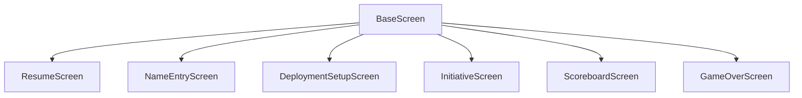
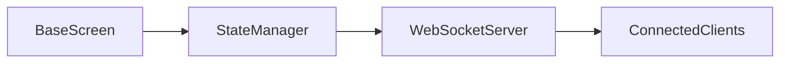

# System Patterns

## Directory Structure

```
pi_app/
│  ├── screens/
│  ├── widgets/
│  ├── state/
│  ├── scorer.kv
│  └── strings.py
├── __init__.py
├── main.py
├── setup.py
└── launch_scorer.sh
```

## Canonical Directory Structure for pi_app/src

- The canonical structure for `pi_app/src` is as follows:

```
pi_app/
│  ├── screens/
│  ├── widgets/
│  ├── state/
│  ├── scorer.kv
│  └── strings.py
├── __init__.py
├── main.py
├── setup.py
└── launch_scorer.sh
```

- This structure is defined by the user and takes precedence over any other documentation or inferred structure.
- No extra folders are to be created unless explicitly requested by the user.

## Architecture Overview

### Component Structure

1. **Pi App**

   - Primary interface
   - Game state source
   - Touch screen control

2. **State Server**

   - State synchronization
   - WebSocket server
   - Database management

3. **Phone Clients**
   - Mobile interface
   - Real-time updates
   - Score submission

### Communication Flow

1. **State Updates**

   - Pi App → State Server
   - State Server → Phone Clients
   - Phone Clients → State Server

2. **Data Flow**
   - Game state persistence
   - Real-time synchronization
   - Error recovery

## System Patterns

### State Management

1. **Centralized State**

   - Single source of truth
   - Atomic updates
   - State validation

2. **State Synchronization**
   - Real-time updates
   - Conflict resolution
   - Error recovery

### Error Handling

1. **System-wide**

   - Graceful degradation
   - Error recovery
   - State preservation

2. **Component-specific**
   - Local error handling
   - State recovery
   - User feedback

### Security

1. **Authentication**

   - Client verification
   - Session management
   - Access control

2. **Data Protection**
   - State validation
   - Input sanitization
   - Error handling

## Best Practices

### Code Organization

1. **Component Structure**

   - Clear separation
   - Proper interfaces
   - Consistent patterns

2. **Documentation**
   - Component-specific
   - System-wide
   - Cross-references

### Testing

1. **Unit Tests**

   - Component-specific
   - System-wide
   - Integration tests

2. **Validation**
   - State validation
   - Error handling
   - Performance testing

### Performance

1. **Optimization**

   - State management
   - Network usage
   - Resource utilization

2. **Monitoring**
   - Performance metrics
   - Error tracking
   - State validation

## Related Documentation

### Core Memory Bank

- [projectbrief.md](projectbrief.md)
- [productContext.md](productContext.md)
- [techContext.md](techContext.md)
- [activeContext.md](activeContext.md)
- [progress.md](progress.md)
- [im-a-dummy.md](im-a-dummy.md)

### Component Memory Banks

- [Pi App Memory Bank](../pi_app/memory-bank/)
- [State Server Memory Bank](../state_server/memory-bank/)
- [Phone Clients Memory Bank](../phone_clients/memory-bank/)

## Screen Management

### Base Screen Pattern

The `BaseScreen` class provides a foundation for all screens in the application, implementing common functionality and standardizing behavior.

#### Core Features

- State management
- Error handling
- Input validation
- Client synchronization
- Lifecycle management

#### Implementation Guidelines

1. All screens must inherit from `BaseScreen`
2. UI elements defined in screen-specific KV files
3. Required method implementations:
   - `update_view_from_state()`
   - `recover_from_error()`
   - `broadcast_state()`
   - `handle_client_update()`

#### State Management

- Centralized state validation
- Consistent state updates
- State-driven UI updates
- State synchronization

#### Error Handling

- Standardized error types
- Consistent error display
- Automatic error recovery
- Error state management

#### Synchronization

- Standardized sync patterns
- Client state management
- Real-time updates
- State broadcasting

## Component Relationships

### Screen Hierarchy



### State Flow



## Design Patterns

### Screen Implementation

1. Inherit from BaseScreen
2. Define UI in KV file
3. Implement required methods
4. Handle state updates
5. Manage errors
6. Sync with clients

### State Management

1. Validate state
2. Update state
3. Broadcast changes
4. Handle updates
5. Recover from errors

### Error Handling

1. Use error types
2. Display errors
3. Handle recovery
4. Clear errors
5. Log issues

### Synchronization

1. Start sync
2. Handle updates
3. Broadcast state
4. Stop sync
5. Handle errors

## Implementation Details

### Base Screen

- Core functionality
- State management
- Error handling
- Synchronization
- Lifecycle management

### Screen Requirements

- Inherit from BaseScreen
- Define UI in KV
- Implement methods
- Handle state
- Manage errors
- Sync clients

### State Management

- Validate state
- Update state
- Broadcast changes
- Handle updates
- Recover errors

### Error Handling

- Use error types
- Display errors
- Handle recovery
- Clear errors
- Log issues

### Synchronization

- Start sync
- Handle updates
- Broadcast state
- Stop sync
- Handle errors

## Best Practices

### Screen Implementation

1. Use BaseScreen
2. Define UI in KV
3. Implement methods
4. Handle state
5. Manage errors
6. Sync clients

### State Management

1. Validate state
2. Update state
3. Broadcast changes
4. Handle updates
5. Recover errors

### Error Handling

1. Use error types
2. Display errors
3. Handle recovery
4. Clear errors
5. Log issues

### Synchronization

1. Start sync
2. Handle updates
3. Broadcast state
4. Stop sync
5. Handle errors

## Test-Driven Documentation Principles

### Core Principles

1. Documentation is the Source of Truth

   - All tests MUST be based on documentation requirements
   - Tests can NEVER be modified to match implementation
   - Implementation must be modified to match tests
   - Documentation drives all test changes

2. Test Implementation Rules

   - Tests must be written based on documented requirements
   - Tests must validate documented behavior
   - Tests must cover all documented features
   - Tests must include documented error cases
   - Tests must verify documented state transitions

3. Documentation-Implementation Relationship

   - Documentation is the contract
   - Tests verify the contract
   - Implementation fulfills the contract
   - If implementation differs from documentation:
     a. Update implementation to match documentation
     b. NEVER modify tests to match implementation
     c. NEVER modify documentation to match implementation

4. Test Maintenance
   - When documentation changes, tests must be updated
   - When tests fail, implementation must be fixed
   - When implementation changes, tests must still pass
   - Test modifications require documentation updates first

### Implementation Guidelines

1. Test Development Process

   - Read and understand documentation first
   - Write tests based on documented requirements
   - Implement features to pass tests
   - Never modify tests to match implementation

2. Documentation Updates

   - Update documentation when requirements change
   - Update tests to reflect documentation changes
   - Update implementation to match new tests
   - Maintain consistency between all three

3. Quality Assurance

   - Tests must cover all documented features
   - Tests must validate all documented behaviors
   - Tests must include all documented error cases
   - Tests must verify all documented state transitions

4. Change Management
   - Document changes before implementing
   - Update tests before changing implementation
   - Verify implementation matches documentation
   - Ensure tests remain valid and comprehensive

## Kivy and Python Import Path Patterns (Critical)

### Problem

- Kivy's `#:import` in `.kv` files does not use the same import resolution as standard Python imports.
- If you use `#:import UI_STRINGS strings.UI_STRINGS`, Kivy looks for a top-level `strings.py` in the current working directory or in `PYTHONPATH`.
- If you use `from strings import UI_STRINGS` in Python, it only works if `strings.py` is in the current directory or in `PYTHONPATH`.
- Running the app or tests from different directories (project root vs. `pi_app`) changes what works.
- On the Pi, or in CI, the working directory is usually the project root, so `strings.py` is not found unless you use the full package path or set `PYTHONPATH`.

### What Doesn't Work

- Using `#:import UI_STRINGS strings.UI_STRINGS` in `.kv` files if `strings.py` is not in the root directory or not in `PYTHONPATH`.
- Using relative imports in Python (e.g., `from .strings import UI_STRINGS`) if the module is run as `__main__` or from a different directory.
- Relying on the dev machine's environment ("just work" without replicating the same setup on the Pi.

### Solution / Pattern

- **Always use the full package path in both Python and KV files:**
  - In Python: `from pi_app.strings import UI_STRINGS`
  - In KV: `#:import UI_STRINGS pi_app.strings.UI_STRINGS`
- **Set `PYTHONPATH` to include the project root** before running the app or tests:
  - `export PYTHONPATH=/path/to/Scorer:$PYTHONPATH`
- **Run the app/tests from the project root** for consistency.
- **Never use ambiguous or relative imports** in `.kv` or `.py` files for shared modules.
- **Document this pattern in both systemPatterns.md and .cursorrules.**

### Example

```kv
#:import UI_STRINGS pi_app.strings.UI_STRINGS
```

```python
from pi_app.strings import UI_STRINGS
```

### Summary

- Consistency in import paths and environment is critical for cross-platform (dev/Pi/CI) reliability.
- Always use absolute package paths and set `PYTHONPATH` to the project root.
- This avoids repeated import errors and environment-specific bugs.
